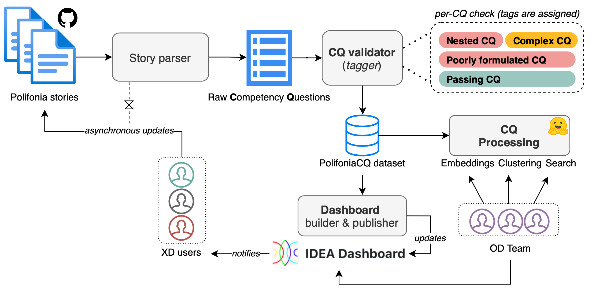

# IDEA: Infer, DEsign, creAte
A collection of prototypes for LM-assisted ontology engineering.

[](https://zenodo.org/badge/latestdoi/599016460)
[](https://opensource.org/licenses/ISC)

IDEA provides analytical tools for ontology design based on state-of-the-art natural language methods. To date, IDEA extracts the competency questions from an ontology repository, analyses them to find inconsistencies and similarities, and visually project them to a sentencelevel embedding space - hence allowing for semantic search. IDEA has been used in WP2, it allowed us to improve our work on refining requirements among the pilots, refining them in collaboration with the experts, therefore supporting the refactoring of PON. In sum, he framework has demonstrated to create synergies between different stakeholders, and to accelerate/support ontology design activities. A live dashboard is available at [this link](polifonia-project.github.io/idea/), with a screenshot reported below.



## Functionalities of IDEA

### Currently supported
- [X] Automatic construction of PolifoniaCQ dataset with CQ checks
- [X] Dashboard website
- [X] Automatic dashboard update
- [X] CQ embeddings and interactive visualisation
- [X] Semantic search of CQs via sentence embeddings

### Next up
- [ ] Support of semantic search on dashboard website
- [ ] Use of graph generation tools for prototyping


---

## Installation
It is recommended to install the development version of IDEA (the one that we currently support) on a separate environment. If you use conda, these commands will do it for you.
```bash
conda create -n 'idea' python=3.9
conda activate idea
```
Once in your environment, you can install requirements using `pip` as follows.
```bash
pip install -r requirements.txt
```

## Documentation
The main entry point is through the CLI provided by `idea.py`. This is also how content is updated before being commited and pushed to this repository. This also allows to re-compute the dashboard with the latest data running at [this link](polifonia-project.github.io/idea/).
```
Command line interface of the IDEA framework.

positional arguments:
  {dataset,embed,search}
                        Either dataset, embed, search.
  input_dir             Directory where the input files will be read.

optional arguments:
  -h, --help            show this help message and exit
  --out_dir OUT_DIR     Directory where output will be saved.
  --model MODEL         Name of the language model to use.
  --validate            Whether to validate the competency questions.
  --search_query SEARCH_QUERY
                        A textual query to search against the CQs.
  --as_session          Whether to keep a session for more searches.
  --search_topk SEARCH_TOPK
                        Number of CQs to retrieve per semantic search.
  --search_threshold SEARCH_THRESHOLD
                        Similarity threshold for semantic search.
  --device DEVICE       The default device to use for computation.
  --n_workers N_WORKERS
                        Number of workers for parallel computation.
```
### Create or update a CQ dataset
To create a dataset of competency questions, just call the following command by specifying the directory where personas and stories are stored. This will also update the documentation on the online dashboard. In this case, we are using a path to [another repository](https://github.com/polifonia-project/stories) in Polifonia.  
```bash
python idea.py dataset ../../stories --validate
```

### Compute and visualise CQ embeddings

```bash
python idea.py embed ../data/cq_sanity_checks.csv --model all-MiniLM-L6-v2 --device cpu
```

### Multi-lingual semantic search of CQs

For a single search just call:
```bash
python idea.py search ../data --search_query instruments --search_topk 20
```
Otherwise, to keep a session for searching CQs without the need to re-load the model:
```bash
python idea.py search ../data --as_session --search_topk 20
```
