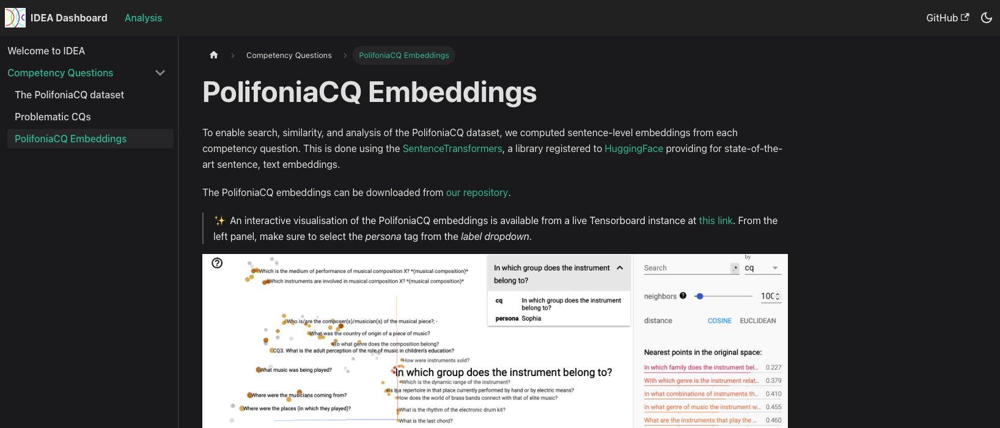

# Infer, Design, Create (IDEA)
A collection of prototypes for LM-assisted ontology engineering.

IDEA provides analytical tools for ontology design based on state-of-the-art natural language methods. To date, IDEA extracts the competency questions from an ontology repository, analyses them to find inconsistencies and similarities, and visually project them to a sentencelevel embedding space - hence allowing for semantic search. IDEA has been used in WP2, it allowed us to improve our work on refining requirements among the pilots, refining them in collaboration with the experts, therefore supporting the refactoring of PON. In sum, he framework has demonstrated to create synergies between different stakeholders, and to accelerate/support ontology design activities. A live dashboard is available at [this link](polifonia-project.github.io/idea/), with a screenshot reported below.



## Functionalities of IDEA

### Currently supported
- [X] Automatic construction of PolifoniaCQ dataset with CQ checks
- [X] Dashboard website
- [X] Automatic dashboard update
- [X] CQ embeddings and interactive visualisation
- [X] Semantic search of CQs via sentence embeddings

### Next up
- [ ] Support of semantic search on dashboard website
- [ ] Use of graph generation tools for prototyping

---

## Documentation
The main entry point is through the CLI provided by `idea.py`. This is also how content is updated before being commited and pushed to this repository. This also allows to re-compute the dashboard with the latest data running at [this link](polifonia-project.github.io/idea/).
```
Command line interface of the IDEA framework.

positional arguments:
  {dataset,embed,search}
                        Either dataset, embed, search.
  input_dir             Directory where the input files will be read.

optional arguments:
  -h, --help            show this help message and exit
  --out_dir OUT_DIR     Directory where statistics will be saved.
  --model MODEL         Name of the language model to use.
  --search_query SEARCH_QUERY
                        A textual query to search against the CQs.
  --as_session          Whether to keep a session for more searches.
  --search_topk SEARCH_TOPK
                        Number of CQs to retrieve per semantic search.
  --search_threshold SEARCH_THRESHOLD
                        Similarity threshold for semantic search.
  --device DEVICE       The default device to use for computation.
  --n_workers N_WORKERS
                        Number of workers for stats computation.
```
### Create or update a CQ dataset
To create a dataset of competency questions, just call the following command by specifying the directory where personas and stories are stored. In this case, we are using a path to [another repository](https://github.com/polifonia-project/stories) in Polifonia.  
```bash
python idea.py dataset ../../stories
```

### Compute and visualise CQ embeddings

```bash
python idea.py embed ../data/cq_sanity_checks.csv --model all-MiniLM-L6-v2 --device cpu
```

### Multi-lingual semantic search of CQs

For a single search just call:
```bash
python idea.py search ../data --search_query instruments --search_topk 20
```
Otherwise, to keep a session for searching CQs without the need to re-load the model:
```bash
python idea.py search ../data --as_session --search_topk 20
```

## License

Copyright (c) 2023 Polifonia H2020

Permission is hereby granted, free of charge, to any person obtaining a copy
of this software and associated documentation files (the "Software"), to deal
in the Software without restriction, including without limitation the rights
to use, copy, modify, merge, publish, distribute, sublicense, and/or sell
copies of the Software, and to permit persons to whom the Software is
furnished to do so, subject to the following conditions:

The above copyright notice and this permission notice shall be included in all
copies or substantial portions of the Software.

THE SOFTWARE IS PROVIDED "AS IS", WITHOUT WARRANTY OF ANY KIND, EXPRESS OR
IMPLIED, INCLUDING BUT NOT LIMITED TO THE WARRANTIES OF MERCHANTABILITY,
FITNESS FOR A PARTICULAR PURPOSE AND NONINFRINGEMENT. IN NO EVENT SHALL THE
AUTHORS OR COPYRIGHT HOLDERS BE LIABLE FOR ANY CLAIM, DAMAGES OR OTHER
LIABILITY, WHETHER IN AN ACTION OF CONTRACT, TORT OR OTHERWISE, ARISING FROM,
OUT OF OR IN CONNECTION WITH THE SOFTWARE OR THE USE OR OTHER DEALINGS IN THE
SOFTWARE.