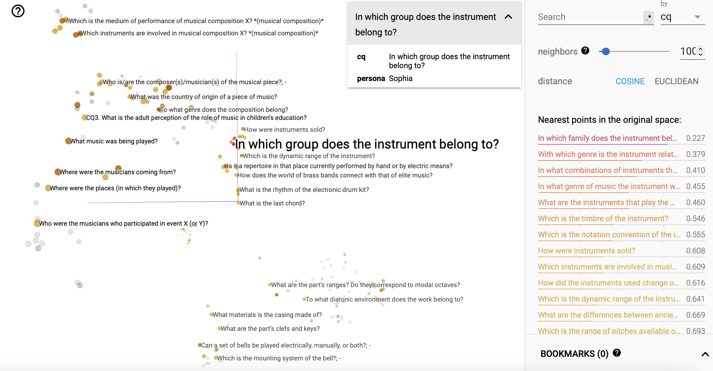

# PolifoniaCQ Embeddings

To enable search, similarity, and analysis of the PolifoniaCQ dataset, we computed sentence-level embeddings from each competency question. This is done using the [SentenceTransformers](https://www.sbert.net), a library registered to [HuggingFace](https://huggingface.co) providing for state-of-the-art sentence, text embeddings.

The PolifoniaCQ embeddings can be downloaded from [our repository](https://github.com/polifonia-project/idea/tree/main/data/projections/00000/PolifoniaCQ).

> :sparkles: An interactive visualisation of the PolifoniaCQ embeddings is available from a live Tensorboard instance at [this link](https://projector.tensorflow.org/?config=https://raw.githubusercontent.com/polifonia-project/idea/main/data/projections/projector_config.json). From the left panel, make sure to select the *persona* tag from the *label dropdown*.

